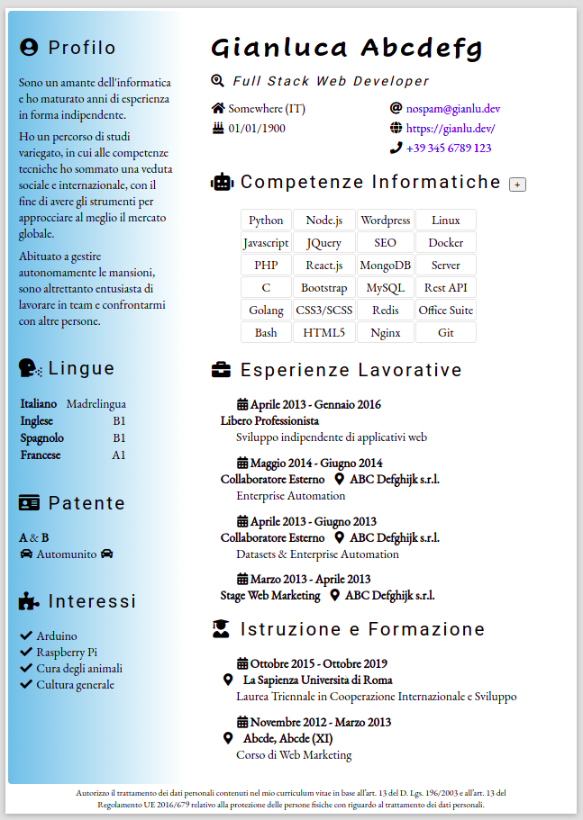

# My Curriculum Vitae with PHP Backend

Progetto esemplificativo utilizzo PHP.\
Permette di aggiungere e rimuovere competenze interfacciandosi dinamicamente ad un database MySQL.

Creato "from the ground up" con CSS3 & CSS Grid



## Utilizzo con Docker

```

docker-compose build
docker-compose up -d

```
